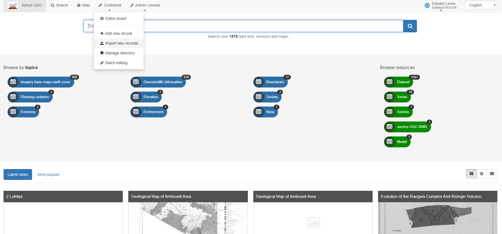

# Using GeoNetwork 

When you first load GeoNetwork the thumbnails/images will not be shown as these are hosted on a secure server. 

Therefore to see these you need to log on to that system via GeoNetwork. 

Open any record which is owned by the GDC which has a map associated with it such as:

http://10.121.22.252:8080/geonetwork/srv/eng/catalog.search#/metadata/d240dbbd-66f9-47e6-919b-0a42a7060c65

Click on the “Open Link” button in the Downloads and Links section. 

A popup window will ask for your login details, please complete using your normal windows login credentials. The requested map will then open in the browser. 

Return to the GeoNetwork home page and hit refresh in your browser

All thumbnails should now be visible. 


# Kenya GDC Internal GeoNetwork Installation


## Install GeoNetwork 


Run each of the following commands individually on a terminal window. If any fail it is likely to be due to poor internet connection and running them a second time usually works.

```bash
sudo apt-get install
sudo apt-get install apt-transport-https
sudo apt-get install ca-certificates
sudo apt-get install curl
sudo apt-get install gnupg-agent
sudo apt-get install software-properties-common
curl -fsSL https://download.docker.com/linux/ubuntu/gpg | sudo apt-key add –
sudo apt-key fingerprint 0EBFCD88
sudo add-apt-repository "deb [arch=amd64] https://download.docker.com/linux/ubuntu $(lsb_release -cs) stable"
sudo apt-get update
sudo apt-get install docker-ce docker-ce-cli containerd.io
sudo docker run hello-world
sudo docker pull geonetwork
sudo systemctl enable docker
sudo docker run --restart unless-stopped --name kenya-geonetwork -d -p 8080:8080 -e DATA_DIR=/var/lib/geonetwork_data -v /host/geonetwork-docker:/var/lib/geonetwork_data geonetwork
```

Persisted data can be found at /host/geonetwork-docker/…..

If the installation is a success, you should be able to access the following web page:


Turn if Off/On to test.....

## Legacy Data Entry into GeoNetwork Walkthrough

### Introduction

The document gives a brief guide to initialisation of GeoNetwork with Asset Register data
It assumes an up to date functioning copy of GeoNetwork is running. 

### Workflow

- Convert Asset Register to Input Template
- Map input template to ISO19139/ISO19115 tags and generate XML files for each record
- Copy records to server (in mounted volume folder if using Docker)

```
/var/lib/geonetwork_data/…. 
```

Log into GeoNetwork
 
Go to Contribute > import new records 

  

 

```
/var/lib/geonetwork_data/data/kenxml_20191115
```

If don’t have suitable Group name available go to the Admin console and create one

 

### Thumbnails

Thumbnails had to be generated and location of files added to Asset Register Input Template

Installed https://www.bricelam.net/ImageResizer/
Used as per instructions on all raster files on W: drive
Used custom image size of maximum 600 pixels in either orientation, “fit” to maintain aspect ratio
  
Changed filename to append ”_Thumb” to original
Files stay in original folder locations & copied to open/less secure folder "metadata" so more users with less permissions can view the thumbnails. 
 
URL of file location added as new attribute to Asset register Template worksheet, can’t use W:\ or gdcs1\ 
MUST BE

http://gdcs1.gdc.com/spatialdata/raster/geological/sketch_plans/Report%20No.7_Thumb.jpg

## Backing Up

Using Docker we can commit docker container to an image. As we have a mounted volume we also need a copy of the data in that volume. 

### Saving the Container

```bash
gdc_admin@GDCS3:~/Documents$ sudo docker image ls
```

```bash
REPOSITORY          TAG                 IMAGE ID            CREATED             SIZE
geonetwork          latest              c8d04e0920a2        3 weeks ago         812MB
hello-world         latest              fce289e99eb9        10 months ago       1.84kB
```

```bash
gdc_admin@GDCS3:~/Documents$ sudo docker container ls
```

```bash
CONTAINER ID        IMAGE               COMMAND                  CREATED             STATUS              PORTS                    NAMES
0ba76a0dd671        geonetwork          "/entrypoint.sh cata…"   2 weeks ago         Up 6 days           0.0.0.0:8080->8080/tcp   kenya-geonetwork
```

```bash
gdc_admin@GDCS3:~/Documents$ sudo docker commit 0ba76a0dd671 kengn
```

```bash
sha256:1addea4861b47963f99a38bf27e468504c3148bf36e0c92595f3e7c51e9560a5
```

```bash
gdc_admin@GDCS3:~/Documents$ sudo docker image ls
```

```bash
REPOSITORY          TAG                 IMAGE ID            CREATED             SIZE
kengn               latest              1addea4861b4        10 seconds ago      1.04GB
geonetwork          latest              c8d04e0920a2        3 weeks ago         812MB
hello-world         latest              fce289e99eb9        10 months ago       1.84kB
```

```bash
gdc_admin@GDCS3:~/Documents$ sudo docker save -o /home/gdc_admin/Documents/kenyagn.tar kengn
```

```bash
gdc_admin@GDCS3:~/Documents$ sudo chown gdc_admin:gdc_admin kenyagn.tar
```

### Saving the files 

Navigate to /host/ right click on the folder "geonetwork-docker" and compress to tar.xz

Copy kenyagn.tar and geonetwork-docker.tar.xz where ever required. 

## Screen Captures


## Moving from Mounts to Volumes

https://stackoverflow.com/questions/49888014/move-docker-bind-mount-to-volume

Copy existing mounted folder only a created volume in a docker container

edd@edd-VirtualBox:~$ sodo docker run --name kengn2 -d -p 8081:8080 -e DATA_DIR=/var/lib/geonetwork_data -v kenya-data:/var/lib/geonetwork_data kengn

Command 'sodo' not found, did you mean:

  command 'nodo' from snap nodo (master)
  command 'todo' from deb devtodo
  command 'sudo' from deb sudo
  command 'sudo' from deb sudo-ldap

See 'snap info <snapname>' for additional versions.

edd@edd-VirtualBox:~$ sudo docker run --name kengn2 -d -p 8081:8080 -e DATA_DIR=/var/lib/geonetwork_data -v kenya-data:/var/lib/geonetwork_data kengn
33ab148b4dedbeeb5bde95aaf12c0c15e2f78b212ead44423aeeee344fe9847e
edd@edd-VirtualBox:~$ sudo docker stop kenyagn
kenyagn
edd@edd-VirtualBox:~$ sudo docker copy /host/geonetwork-docker kengn2:kenya-data
docker: 'copy' is not a docker command.
See 'docker --help'
edd@edd-VirtualBox:~$ sudo docker cp /host/geonetwork-docker kengn2:kenya-data
edd@edd-VirtualBox:~$ sudo docker stop kengn2
kengn2
edd@edd-VirtualBox:~$ sudo docker start kengn2
kengn2


Backing up volume 

https://blog.ssdnodes.com/blog/docker-backup-volumes/ 
